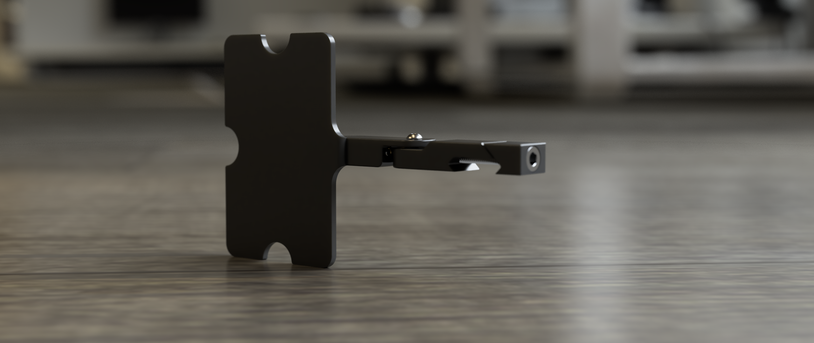

# DOPE Card Holder

## Printing instructions

Recommended printing settings:

- tinitial layer height: 0.25mm
- tlayer height: 0.2mm
- tbottom/top/perimeters: 4
- tinfill: more than 40%
- tinfill type: cubic
- thin walls: on
